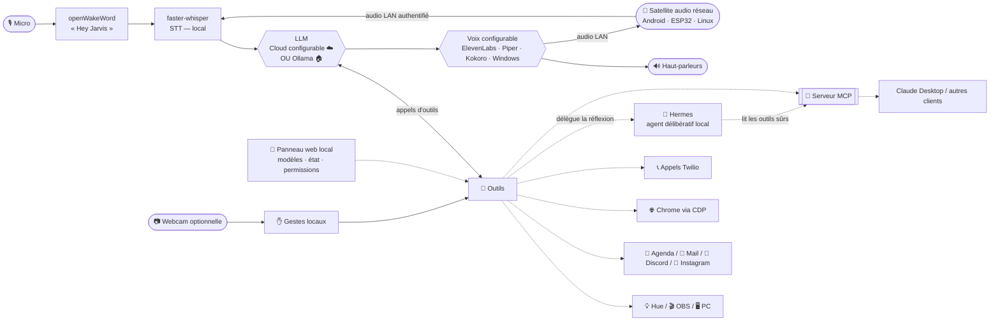

# 🤖 Jarvis — assistant vocal local

*[English version](README.en.md)*


Un assistant vocal en français qui tourne **sur ta machine**. Dis *« Hey Jarvis »*,
parle naturellement : il raisonne avec un LLM, utilise une boîte à outils extensible
(domotique, PC, web, téléphone…) et te répond à voix haute. Trois modes distincts :
**hybride** (IA cloud quotidienne + Hermes pour le fond), **qualité** (modèle cloud
le plus puissant configuré) ou **100 % local hors ligne** (Ollama + voix locale).
Le LLM et la voix se choisissent séparément. **OpenAI et Claude/Anthropic sont
intégrés aujourd'hui** ; d'autres fournisseurs, comme Gemini, peuvent être ajoutés
par connecteur sans changer ces trois modes.

**🧠 Jarvis + Hermes.** Pour la réflexion de fond et la recherche, Jarvis **délègue à
[Hermes](docs/hermes.md)**, un agent délibératif qui tourne **en local** (conteneur
Docker, recommandé dans une VM Ubuntu isolée). La doctrine est nette : **Hermes orchestre et pense ; Jarvis détient les clés
et le corps** — c'est toujours Jarvis qui exécute les actions, jamais Hermes, et
**aucun identifiant ne vit dans l'environnement d'Hermes** (il lit le Vault et les
outils sûrs, écrit seulement des brouillons).

**📡 Jarvis dans chaque pièce.** Ajoute un ou plusieurs **satellites audio réseau**
pour déporter le micro et le haut-parleur dans la cuisine, le salon ou une autre
pièce. Le PC reste le cerveau central ; aucun long câble ne le relie aux pièces.
Le client disponible aujourd'hui cible Raspberry Pi/Linux, mais le protocole est
prévu pour accueillir des solutions moins chères : ancien téléphone Android,
ESP32 avec audio ou Pi Zero ([options et fonctionnement](docs/satellite.md) ·
[guide de choix et d'installation](docs/satellite_installation.md) ·
[installation Raspberry/Linux détaillée](docs/satellite_pi.md)).

> Projet perso partagé tel quel. Cible **Windows 11**, nécessite un micro et (en mode
> cloud) une clé API du fournisseur choisi. Les abonnements grand public et les API
> sont généralement séparés. La plupart des intégrations sont **optionnelles** et se
> désactivent proprement si non configurées.

## ✨ Fonctionnalités

- 🎙️ **Tout à la voix** — mot d'activation (openWakeWord), transcription locale (Whisper), réponses parlées
- 👁️ **Vision de l'écran** — « c'est quoi cette erreur ? », « lis ça », « traduis » (capture → LLM)
- 💡 **Domotique** — Philips Hue (allumer, luminosité, couleur), ambiances/scènes
- 🎬 **Streaming** — contrôle d'OBS (direct, enregistrement, scènes, replay)
- 🖥️ **Contrôle PC** — lancer des apps, média/volume, stats GPU/CPU/RAM en direct
- 📅 **Agenda** — Google Agenda sur **tous** tes agendas (y compris abonnés iCal), création/suppression avec confirmation
- 📧 **Mail** — résumés Gmail et rédaction
- 💬 **Discord** — mentions + récap des messages du jour
- 📸 **Instagram** — abonnés & vues des vidéos vs la veille (multi-comptes)
- 🍽️ **Réservations web** — réserve resto/rendez-vous via un vrai navigateur (Playwright)
- 🌐 **Assistant navigateur** — résume/traduit l'onglet actif, gère les onglets, agit sur les pages (ton vrai Chrome)
- 📞 **Appels téléphoniques** — Twilio : jouer un message, ou une vraie conversation temps réel
- 🧠 **Mémoire long terme** — retient tes préférences, tes proches, tes projets
- 📱 **Pont iPhone** — envoie idées/notes et commandes depuis l'app Raccourcis (Siri comme télécommande à distance)
- 🎭 **Personnalités** — majordome sarcastique, neutre, concis — changeable à la voix
- 🏠 **Présence** — ping ton téléphone, déclenche des scènes quand tu pars/reviens
- 🚀 **Démarrage & scènes automatiques** — lance Jarvis et sa chaîne locale à l'ouverture de session, joue un brief météo/agenda au premier démarrage de la journée et prépare une extinction propre
- 🌤️ **Utilitaires** — météo, minuteurs, heure/date
- 🔌 **Serveur MCP** — expose les outils domotique/PC à tout client MCP (Claude Desktop, Hermes…)
- 🎬 **Hub de contenu** — vault d'inspirations Insta/TikTok (télécharge, transcrit, indexe), idées & scripts générés, ingestion YouTube ([docs/hub_contenu.md](docs/hub_contenu.md))
- 🗂️ **Suivi de contenus** — pipeline vidéo *idée → script → tournage → montage → publié*, croisé avec ton agenda ; « où j'en suis ? » ([docs/suivi_contenu.md](docs/suivi_contenu.md))
- 🤝 **Délégation à Hermes** — confie la réflexion / recherche de fond à un agent délibératif **local** (doctrine : Jarvis tient les clés & le corps, Hermes pense) ([fonctionnement](docs/hermes.md) · [serveur Ubuntu/Hyper-V](docs/hermes_server_vm.md))
- 🧭 **HUD & panneau web local** (`/panneau`) — commandes rapides de modèle/voix, état de la chaîne, réglages et permissions — **accessibles en local uniquement** ([docs/panneau.md](docs/panneau.md))
- 🔐 **Sécurité graduée** — niveaux **N1/N2/N3** par outil, « toujours autoriser » révocable, budget LLM par fournisseur
- 💸 **Routage & budgets** — 3 modes (local / hybride / qualité), fournisseur cloud et voix configurables séparément, suivi des coûts et **bascule auto en local** au plafond ([docs/costs.md](docs/costs.md))
- 📊 **Cockpit personnel local** — abonnements, échéances, détection par reçus Gmail et import CSV de transactions ; les données financières restent gitignorées et ne sont jamais exposées à Hermes/MCP ([docs/cockpit.md](docs/cockpit.md))
- ⏻ **Extinction / réveil du PC** — extinction propre à la voix (confirmation N3, délai annulable) ; méthodes génériques de réveil documentées selon le matériel ([docs/wol.md](docs/wol.md))
- ✋ **Contrôle optionnel par caméra et gestes** — avec une webcam configurée, les modes **Fenêtres** (changer/défiler) et **Audio** (volume/pistes) complètent les actions lumière/média/OBS ; traitement **100 % local**, aucune image ne sort ([docs/gestes.md](docs/gestes.md))
- 📡 **Satellites multi-pièces** — déporte micro et haut-parleur sur un client réseau ; Raspberry/Linux est disponible, le Pi Zero 2 W est expérimental, et Android/ESP32 audio restent des cibles à développer. Wake word local, LAN authentifié, contexte de la pièce et confirmations vocales sensibles ([installation et choix du matériel](docs/satellite_installation.md) · [protocole](docs/satellite.md))
- 🎵 **Reconnaissance musicale** — « c'est quoi cette musique ? » (micro de la pièce **ou** son d'une vidéo/reel via loopback), à la demande uniquement ([docs/musique.md](docs/musique.md))
- 🪟 **Overlay de réponses** — mini-fenêtre flottante qui affiche à l'écrit ce que Jarvis dit, sans jamais voler le focus (topmost, clic-transparent, invisible en stream), 2e écran configurable + mode silencieux visuel ([docs/overlay.md](docs/overlay.md))
- 🏠 **Google Home / Nest** — *(⚠️ expérimental)* liste des appareils Nest + état ([docs/google_home.md](docs/google_home.md))
- 🔵 **Alexa / Echo** — *(via API non officielle)* annonces/TTS, média, et contrôle d'appareils via Routines (« allume la clim », « éteins la télé ») ([docs/alexa.md](docs/alexa.md))

## 🎬 Démo

> 📺 *Vidéo / GIF de démo à venir — placeholder.*

## 🏗️ Architecture



> **Jarvis tient les clés & le corps** (il exécute) ; **Hermes pense** (réflexion, recherche,
> analyse du Vault). Hermes ne voit que les **outils sûrs** exposés par le serveur MCP de Jarvis.

## 🎚️ Les trois modes

| Mode | LLM | Voix | Usage |
|---|---|---|---|
| **hybride** *(défaut)* | profil quotidien OpenAI ou Claude/Anthropic | moteur choisi séparément | demandes courtes en cloud, tâches de fond confiées à Hermes |
| **qualité** | profil le plus puissant du même fournisseur | moteur choisi séparément | demandes exigeantes et raisonnement renforcé |
| **local** | Ollama (`qwen3.5:4b`…) | Piper, Kokoro ou Windows | **100 % hors ligne**, aucune API et aucun coût d'usage |

La transcription faster-whisper reste locale dans les trois modes.

> **Petit budget cloud ?** Le mode local est disponible aujourd'hui sans coût
> d'API. Des connecteurs optionnels **Gemini (niveau gratuit)** et **DeepSeek
> (paiement à l'usage économique)** sont proposés dans la roadmap, mais ne sont
> pas encore intégrés. Le projet, les limites et les précautions de confidentialité
> sont détaillés dans [le guide des coûts](docs/costs.md#proposition-pour-les-petits-budgets-cloud-roadmap).

Bascule en une ligne : `mode: local`, `hybride` (défaut) ou `qualite` — ou à la voix « passe en local ». Voir [docs/local.md](docs/local.md) et [docs/costs.md](docs/costs.md)
pour le bilan honnête de fiabilité (un modèle 7B gère bien les outils domotique/PC ;
les **features à vision comme le navigateur & les réservations restent cloud recommandé**).

**Matériel local (honnête) :** Whisper `medium` ≈ 2–3 Go VRAM, `qwen3.5:4b` (Q4) ≈ 3 Go —
une carte **6 Go** (RTX 2060/3060) fait tourner les deux confortablement. Le `qwen3.5:9b`
(~6 Go) demande plus de marge. Piper est temps réel sur CPU. `python scripts/doctor.py`
conseille le modèle selon ta VRAM.

## 🚀 Démarrage rapide

Prérequis : **Python 3.13**, [uv](https://docs.astral.sh/uv/), Windows 11, un micro.

```bash
uv sync
uv run playwright install chromium        # pour les réservations / le navigateur
copy config.example.yaml config.yaml      # puis remplis ce dont tu as besoin
uv run python jarvis14.py
```

Dis **« Hey Jarvis »**. Il faut soit la clé API du fournisseur cloud sélectionné
(`openai.cle` ou `anthropic.cle`), soit un modèle Ollama en mode local. Tout le reste
est optionnel.

Débutant complet ? Vois **[INSTALL_WITH_AI.md](INSTALL_WITH_AI.md)** — à coller dans
n'importe quelle IA gratuite, elle t'installe tout pas à pas. Ou lance l'installateur
interactif : `python scripts/setup.py`. Un souci ? `python scripts/doctor.py` diagnostique.

## 🤝 Se faire aider par une IA (gratuitement)

**Pour INSTALLER** (aucune connaissance requise) — l'option zéro friction : ouvre
n'importe quel chatbot gratuit ([Claude.ai](https://claude.ai),
[ChatGPT](https://chat.openai.com), [Gemini](https://gemini.google.com)), colle le
contenu de **[INSTALL_WITH_AI.md](INSTALL_WITH_AI.md)**, et laisse-toi guider.

**Pour MODIFIER / bidouiller le code**, plusieurs options gratuites :

- 🏠 **Cline ou Aider + Ollama** — un assistant de code **100 % local et gratuit**, dans
  l'esprit du projet. Le must si tu veux rester hors ligne.
- **Gemini CLI** — gratuit, limites généreuses, agentique dans le terminal.
- **GitHub Copilot Free** — niveau gratuit dans VS Code.
- **Cursor** (offre gratuite) — pratique pour découvrir, mais limité.
- **Claude Code** — si tu l'as (c'est ce qui a construit ce projet).

Aucun outil n'est imposé : prends celui qui te convient.

## ⚙️ Configuration

Tout est dans un unique `config.yaml` **non versionné** (copié depuis
`config.example.yaml`, qui documente chaque clé). Nouvelles sections côté config :
`cloud`/`openai`/`anthropic` (LLM cloud), `tts`/`elevenlabs` (voix), `hermes` (délégation), `integrations`/`hub` (Vault + génération), `suivi` (pipeline
de contenus), `securite.toujours` (autorisations N2 mémorisées), `budget.prix`
(coût LLM), `serveur`/`pont_iphone`. Guides par intégration :

| Intégration | Guide |
|---|---|
| Fournisseurs cloud (OpenAI / Claude) | [docs/openai.md](docs/openai.md) |
| Modes local / hybride / qualité | [docs/local.md](docs/local.md) |
| Routage 3 modes, coûts & budgets | [docs/costs.md](docs/costs.md) |
| Philips Hue | [docs/hue.md](docs/hue.md) |
| OBS | [docs/obs.md](docs/obs.md) |
| Google Agenda + iCal | [docs/agenda.md](docs/agenda.md) |
| Détection de présence | [docs/presence.md](docs/presence.md) |
| Bot Discord | [docs/discord.md](docs/discord.md) |
| Appels Twilio | [docs/appels.md](docs/appels.md) |
| Navigateur (Chrome CDP) | [docs/navigateur.md](docs/navigateur.md) |
| Réservations web | [docs/reservation.md](docs/reservation.md) |
| Instagram | [docs/instagram.md](docs/instagram.md) |
| Serveur MCP | [docs/mcp.md](docs/mcp.md) |
| Pont iPhone (Raccourcis) | [docs/iphone.md](docs/iphone.md) |
| **Hermes (délégation, cloisonnement)** | [docs/hermes.md](docs/hermes.md) |
| **Hub de contenu (Vault + génération)** | [docs/hub_contenu.md](docs/hub_contenu.md) |
| **Suivi de contenus** | [docs/suivi_contenu.md](docs/suivi_contenu.md) |
| **Panneau web (modèles · état · permissions)** | [docs/panneau.md](docs/panneau.md) |
| **Extinction / Wake-on-LAN** | [docs/wol.md](docs/wol.md) |
| **Gestes de la main (webcam)** | [docs/gestes.md](docs/gestes.md) |
| **Satellites audio multi-pièces** | [installation et matériel](docs/satellite_installation.md) · [protocole](docs/satellite.md) · [Raspberry/Linux détaillé](docs/satellite_pi.md) |
| **Reconnaissance musicale (Shazam-like)** | [docs/musique.md](docs/musique.md) |
| **Spotify (playlist des musiques reconnues)** | [docs/spotify.md](docs/spotify.md) |
| **Cockpit (tableau de bord perso, local)** | [docs/cockpit.md](docs/cockpit.md) |
| **Overlay de réponses (fenêtre flottante)** | [docs/overlay.md](docs/overlay.md) |
| **Google Home / Nest** *(⚠️ expérimental)* | [docs/google_home.md](docs/google_home.md) |
| **Alexa / Echo** *(via API non officielle)* | [docs/alexa.md](docs/alexa.md) |
| **Latence perçue (UX)** | [docs/latency.md](docs/latency.md) |

## 🛡️ Éthique & Sécurité

La confiance est intégrée, pas rajoutée :

- **Confirmation vocale** avant toute action irréversible (envoi de mail, réservation, suppression, appel…).
- **Les appels se présentent** honnêtement : *« Bonjour, je suis l'assistant vocal automatisé de [prénom]… »* — jamais en se faisant passer pour un humain.
- **Jamais** de mot de passe ni de données bancaires saisis, jamais de paiement automatique.
- **Domaines protégés** (banque, impôts, santé) sur ton vrai navigateur = **lecture seule**.
- **Secrets & données perso jamais versionnés** (`config.yaml`, mémoire, logs, transcriptions d'appels, tokens OAuth — tous gitignorés).
- Au téléphone, Jarvis ne confirme que ce que tu as validé **avant** l'appel.
- **Niveaux de permission N1/N2/N3** : chaque outil a un niveau — **N1** sûr (auto, local + iPhone), **N2** sensible (confirmation ; « toujours autoriser » révocable), **N3** critique (confirmation à chaque fois, jamais mémorisable, **jamais à distance**). Extinction du PC, mails, appels, réservations = N3.
- **Pont iPhone** : à distance, seuls les outils **sûrs (N1)** s'exécutent ; toute action sensible est refusée (« à faire à la voix à la maison »). Un token volé ne peut qu'allumer/éteindre des lumières.
- **Cloisonnement Hermes** : Hermes lit le Vault et les outils **en lecture seule**, écrit uniquement des brouillons — **aucun credential** dans son environnement.

## 🗺️ Roadmap

- [x] **Délégation à Hermes** (agent délibératif local) + gateway Telegram (whitelist stricte)
- [x] **Hub de contenu** : Vault d'inspirations + génération d'idées/scripts + ingestion YouTube
- [x] **Suivi de contenus** : pipeline idée → publié, croisé avec l'agenda
- [x] **Panneau web local** : modèles · état de la chaîne · permissions **N1/N2/N3** · budget LLM
- [x] **Démarrage automatique & scènes** : chaîne Jarvis/Hermes, brief quotidien météo/agenda et scène d'extinction
- [x] **Extinction propre du PC** (N3, délai annulable) — options de réveil documentées séparément selon le matériel
- [x] **Contrôle caméra/gestes v2** : modes Fenêtres et Audio, calibration locale et garde-fous anti-faux-positifs
- [x] **Cockpit local — phase 1** : abonnements, détection par mail et transactions CSV
- [x] **Client satellite Raspberry Pi/Linux** : audio, wake word, protocole LAN sécurisé et multi-pièces — matériel audio choisi librement par chaque installation
- [ ] **Clients satellites économiques** : ancien téléphone Android et ESP32 audio, sur le même protocole sans déplacer le cerveau hors du PC
- [ ] **Connecteurs cloud économiques optionnels** : Gemini (niveau gratuit) et DeepSeek, avec appels d'outils testés, suivi des coûts et repli local sur quota épuisé
- [ ] Contrôle des lampes vidéo Godox (aujourd'hui Hue seulement)
- [x] Notes / idées (+ pont iPhone via Raccourcis) — rappels programmés à venir
- [ ] Adaptateur générique de réveil/alimentation avec vérification d'état robuste
- [ ] TTS en streaming phrase par phrase (voir [docs/latency.md](docs/latency.md))
- [ ] Boucle navigateur en 100 % local : la vision de `qwen3.5` lit déjà le texte des boutons (testé) — reste à valider le pilotage complet
- [ ] Rafraîchissement auto des tokens Instagram entre redémarrages (partiel aujourd'hui)

## 🤝 Contribuer

Ajouter un outil = un seul fichier dans `tools/` avec un décorateur `@outil(...)` — il
est auto-découvert, aucun câblage. Issues et PR bienvenues. Merci de ne jamais committer
de vrais secrets (vois `.gitignore`).

## 📄 Licence

MIT — voir [LICENSE](LICENSE).
